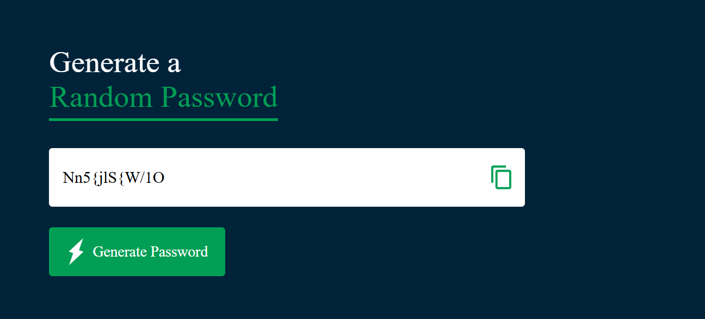

# 🔐 Random Password Generator

A simple **Random Password Generator** built using **HTML, CSS, and JavaScript** that creates strong and secure passwords instantly.
This project demonstrates basic **JavaScript logic, DOM manipulation, and responsive web design** to build a practical and user-friendly web application.

---

## 🚀 Features

* Generate secure random passwords
* One-click password generation
* Copy password to clipboard
* Simple and responsive UI

---

## 🛠️ Tech Stack

* **HTML** – Structure of the application
* **CSS** – Styling and layout
* **JavaScript** – Password generation logic and functionality

---

## 📸 Preview

---

## 📂 How to Run

1. Clone this repository
2. Open the project folder
3. Run `index.html` in your browser

---

## 👩‍💻 Author

**Priya**
Aspiring Software Developer interested in **Java, Data Structures & Algorithms, and Web Development**.
